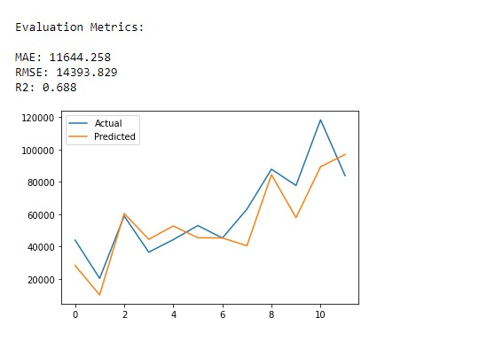
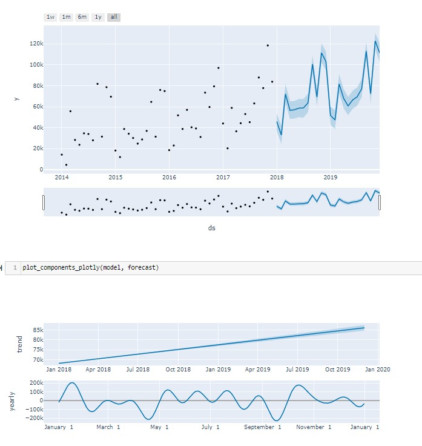

# Store Sales Forecasting

Machine learning can help us discover the factors that influence sales in a retail store and estimate the number of sales that it will have in the near future. For this project, I used fbprophet model created by Facebook Inc.

### About the Model:
Fbprophet is a procedure for forecasting time series data based on an additive model where non-linear trends are fit with yearly, weekly, and daily seasonality, plus holiday effects. It works best with time series that have strong seasonal effects and several seasons of historical data. Prophet is robust to missing data and shifts in the trend, and typically handles outliers well. For more info visit: https://facebook.github.io/prophet/

#### Training the model

#### Sales Forecasting

